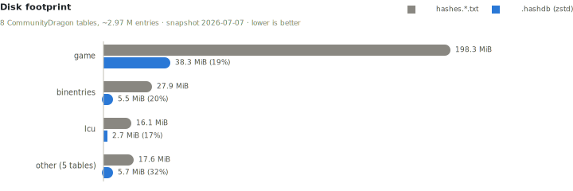
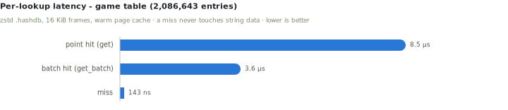
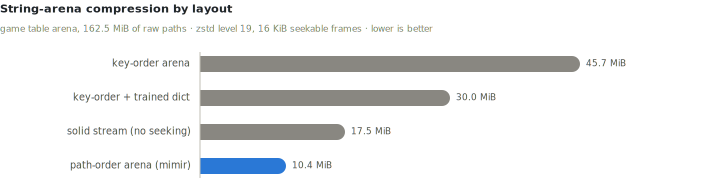

# mimir

A toolkit for **generating**, **storing**, and **serving** League of Legends
hash → path tables as a compact, memory-mapped, seekable binary format (`.hashdb`).
It reimplements and extends CommunityDragon's CDTB `hashes.py` and the
CommunityDragon/Data txt artifacts.

The `.hashdb` format is general-purpose - an mmap-backed, read-only map from integer keys
to string values, with nothing League-specific in its layout. League Toolkit distributes
its own tables in this format under the `.lhdb` extension (identical bytes).

## Why this exists

Almost every League of Legends tool - WAD unpackers, `.bin` inspectors, mod loaders,
asset browsers - hits the same wall: the game identifies files and fields by **hash**,
not by name. To show a human-readable path you need a **hash table** that maps each
hash back to its original string.

Today that table is the CommunityDragon `hashes.*.txt` set: **~348 MB of plain text**,
which every tool downloads and keeps around. That approach has two costs that compound
the moment a machine runs more than one of these tools:

- **Memory.** To resolve hashes efficiently a program has to load the whole table into
  an in-memory map. Run three tools that each need the game hashes and you pay for
  **three private copies** of the same hundreds-of-megabytes table, all resident at once.
- **Startup & distribution.** Every tool ships (or re-downloads) the same giant text
  files and spends time parsing them into a map before it can answer a single query.

**mimir** replaces that text blob with a purpose-built, **read-only** binary format for
hash storage. The design goals are, in order:

1. **Usable as shipped** - no unpack or full-expansion step; a consumer `mmap`s the file
   and immediately does lookups.
2. **Small** - the game table drops from ~348 MB of text to roughly **~50 MB** on disk.
3. **Memory-efficient across processes** - the file is memory-mapped, so the OS page
   cache holds **one** copy that every tool on the machine shares. Resident RAM stays
   low because pages are faulted in lazily and dropped under pressure, and a lookup
   *miss* touches zero string data.

## How it works

A `.hashdb` file is a single logical table laid out for direct, zero-parse use over an
`mmap`:

- **Sorted key array** - the integer hashes, stored strictly ascending so a lookup is a
  **binary search straight over the mapped bytes**. A miss is decided here and never
  reads any string data.
- **Parallel offset + length arrays** - for a found key, where its path lives in the arena
  and how long it is.
- **String arena** - all the path strings concatenated with no separators, compressed as
  a **Zstandard Seekable Format** stream. The seek table means a hit decompresses just the
  **one small frame** that holds its path (default 16 KiB frames), not the whole table -
  so partial, on-demand reads stay cheap. Paths are packed in **lexicographic order** so
  a directory's files land in the same frames, which both compresses far better (~4× vs.
  key order on the real game table) and makes directory-local batch lookups touch fewer
  frames.

The file is immutable once published; updates ship as new versioned files, and a downloaded
file is treated as untrusted - the header is validated on open and every read bounds-checks
its own extent. See [`docs/FORMAT.md`](docs/FORMAT.md) for the byte-level specification.

Because it's memory-mapped and read-only, a lazy consumer (say, a mod loader) can open the
table only when it first needs to resolve a hash, share the page cache with every other
mimir-backed tool running, and drop the handle to reclaim its (already small) footprint.

## Performance

Real-data measurements against the CommunityDragon `hashes.*.txt` snapshot of
2026-07-07 (~2.97 M entries across 8 tables). Full tables, methodology, and
reproduction steps are in [`docs/BENCHMARKS.md`](docs/BENCHMARKS.md).

<picture>
  <source media="(prefers-color-scheme: dark)" srcset="docs/assets/bench-size-dark.svg">
  
</picture>

The whole corpus drops from **~253 MiB of txt to ~52 MiB** of `.hashdb` - and the
binary is usable as-shipped: `open` is a header validation plus an `mmap`, with no
parse or expansion step before the first lookup.

<picture>
  <source media="(prefers-color-scheme: dark)" srcset="docs/assets/bench-latency-dark.svg">
  
</picture>

A hit decompresses exactly one small frame; batched lookups amortize that through
the reader's frame cache. A **miss is decided by binary search over the raw key
section and never touches string data** - ~143 ns whether the file is raw or
compressed, which matters because hash hunting hammers misses.

<picture>
  <source media="(prefers-color-scheme: dark)" srcset="docs/assets/bench-arena-dark.svg">
  
</picture>

Sorting the arena by path packs each directory into the same frames, so the seekable
arena compresses **~4× better than key order** - beating even a solid, non-seekable
zstd stream - while making hits faster and directory-local batches frame-coherent.

## Layout

| Crate | Role |
|-------|------|
| `ltk_hashdb`        | The `.hashdb` format: `mmap` reader (`HashDb`) + streaming writer |
| `ltk_mimir_cache`  | Shared cache dir, manifest, versioned publish, update lock, GC, in-process updater |
| `ltk_mimir_gen`    | Hash-discovery ("hunt") engine for still-unknown hashes |
| `ltk_mimir_cli`    | The `mimir` binary |

## Using it

As a library - open a table and resolve a hash:

```rust
use ltk_hashdb::HashDb;

let db = HashDb::open("game.hashdb")?;          // mmap + validate header, lazy
if let Some(path) = db.get(0x1234_5678_9abc_def0) {
    println!("{path}");
}
```

From the CLI:

```sh
# Build a .hashdb table from a CDragon `<hex-hash> <path>` txt list
mimir build --input hashes.game.txt --table game --out game.hashdb

# Resolve one hash
mimir get 0x1234abcd --file game.hashdb

# Validate a downloaded file (structure + checksum)
mimir verify game.hashdb
```

See [`docs/CONSUMERS.md`](docs/CONSUMERS.md) for the shared-cache and
custom-hash-extension APIs.

## Status

Early development. The `.hashdb` format, reader/writer, the shared cache, release
publishing (`mimir publish` + a scheduled CI job that ships every table as versioned
`.lhdb` GitHub release assets, rebuilt from the canonical CommunityDragon txt lists), the
download-driven `mimir update` flow, and the hunt engine - including WAD string mining
(`mimir gen --wad`) - are in place.

## License

Licensed under either of

- Apache License, Version 2.0 ([LICENSE-APACHE](LICENSE-APACHE) or
  http://www.apache.org/licenses/LICENSE-2.0)
- MIT license ([LICENSE-MIT](LICENSE-MIT) or http://opensource.org/licenses/MIT)

at your option.

Unless you explicitly state otherwise, any contribution intentionally submitted
for inclusion in the work by you, as defined in the Apache-2.0 license, shall be
dual licensed as above, without any additional terms or conditions.
