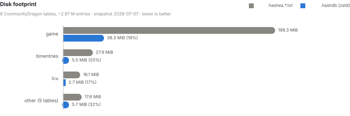
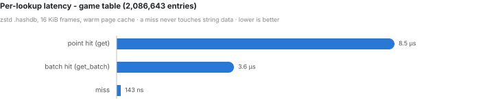
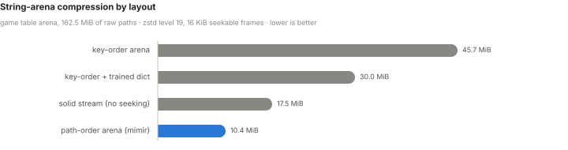

# Design

> Why mimir exists, how the `.hashdb` format is put together, and what it measures.
> For the byte-level specification see [`FORMAT.md`](FORMAT.md); for the integration
> API see [`CONSUMERS.md`](CONSUMERS.md).

## Why this exists

Almost every League of Legends tool - WAD unpackers, `.bin` inspectors, mod loaders,
asset browsers - hits the same wall: the game identifies files and fields by **hash**,
not by name. To show a human-readable path you need a **hash table** that maps each
hash back to its original string.

Today that table is the CommunityDragon `hashes.*.txt` set: **~348 MB of plain text**,
which every tool downloads and keeps around. That approach has two costs that compound
the moment a machine runs more than one of these tools:

- **Memory.** To resolve hashes efficiently a program has to load the whole table into
  an in-memory map. Run three tools that each need the game hashes and you pay for
  **three private copies** of the same hundreds-of-megabytes table, all resident at once.
- **Startup & distribution.** Every tool ships (or re-downloads) the same giant text
  files and spends time parsing them into a map before it can answer a single query.

**mimir** replaces that text blob with a purpose-built, **read-only** binary format for
hash storage. The design goals are, in order:

1. **Usable as shipped** - no unpack or full-expansion step; a consumer `mmap`s the file
   and immediately does lookups.
2. **Small** - the game table drops from ~348 MB of text to roughly **~50 MB** on disk.
3. **Memory-efficient across processes** - the file is memory-mapped, so the OS page
   cache holds **one** copy that every tool on the machine shares. Resident RAM stays
   low because pages are faulted in lazily and dropped under pressure, and a lookup
   *miss* touches zero string data.

## How it works

A `.hashdb` file is a single logical table laid out for direct, zero-parse use over an
`mmap`:

- **Sorted key array** - the integer hashes, stored strictly ascending so a lookup is a
  **binary search straight over the mapped bytes**. A miss is decided here and never
  reads any string data.
- **Parallel offset + length arrays** - for a found key, where its path lives in the arena
  and how long it is.
- **String arena** - all the path strings concatenated with no separators, compressed as
  a **Zstandard Seekable Format** stream. The seek table means a hit decompresses just the
  **one small frame** that holds its path (default 16 KiB frames), not the whole table -
  so partial, on-demand reads stay cheap. Paths are packed in **lexicographic order** so
  a directory's files land in the same frames, which both compresses far better (~4× vs.
  key order on the real game table) and makes directory-local batch lookups touch fewer
  frames.

The file is immutable once published; updates ship as new versioned files, and a downloaded
file is treated as untrusted - the header is validated on open and every read bounds-checks
its own extent. See [`FORMAT.md`](FORMAT.md) for the byte-level specification.

Because it's memory-mapped and read-only, a lazy consumer (say, a mod loader) can open the
table only when it first needs to resolve a hash, share the page cache with every other
mimir-backed tool running, and drop the handle to reclaim its (already small) footprint.

### Reading a path without copying it

A lookup returns a `PathRef`, which borrows rather than allocates. A raw arena lends the
bytes straight out of the mapping; a compressed arena lends them out of the decompressed
frame the table is holding, keeping that frame alive for as long as the path is. Only two
cases copy: an entry that straddles a frame boundary (about one per frame), and one whose
bytes are not valid UTF-8. `PathRef` derefs to `str`, so it reads like one at the call
site.

Decompressed frames are cached in a fixed, byte-capped, N-way set-associative table sized
at open - frames are keyed by a dense index, so no map and no eviction list is needed, and
one lock per set keeps concurrent readers off each other. Buffers from evicted frames are
recycled, so a steady-state miss decompresses into an allocation that already exists.
Because published files are immutable, this is pure memoisation with nothing to
invalidate.

This matters because point lookups are not a niche shape: `ltk_wad`'s `PathResolver` is
point-shaped by construction, so every WAD extractor resolves one hash per chunk whether
it wants to or not.

## Performance

Real-data measurements against the CommunityDragon `hashes.*.txt` snapshot of
2026-07-07 (~2.97 M entries across 8 tables). Full tables, methodology, and
reproduction steps are in [`BENCHMARKS.md`](BENCHMARKS.md).

<picture>
  <source media="(prefers-color-scheme: dark)" srcset="assets/bench-size-dark.svg">
  
</picture>

The whole corpus drops from **~253 MiB of txt to ~52 MiB** of `.hashdb` - and the
binary is usable as-shipped: `open` is a header validation plus an `mmap`, with no
parse or expansion step before the first lookup.

<picture>
  <source media="(prefers-color-scheme: dark)" srcset="assets/bench-latency-dark.svg">
  
</picture>

A hit decompresses exactly one small frame; batched lookups amortize that by resolving in
arena order. A **miss is decided by binary search over the raw key section and never
touches string data** - ~143 ns whether the file is raw or compressed, which matters
because hash hunting hammers misses.

Those point-lookup figures predate the reader's frame cache. With it, one archive's worth
of paths (20 000 entries of the 2 291 324-entry `game-2026-08-14` table, probed in hash
order) measures **1.07 µs cached against 5.92 µs uncached, and 0.66 µs batched** - point
lookups land within 1.6× of the batch path instead of an order of magnitude off it. Keys
scattered across the whole table, where no cache holds the working set, are unchanged at
~6.7 µs. Reproduce with:

```sh
cargo run --release -p ltk_hashdb --example frame_cache -- <table.lhdb>
```

<picture>
  <source media="(prefers-color-scheme: dark)" srcset="assets/bench-arena-dark.svg">
  
</picture>

Sorting the arena by path packs each directory into the same frames, so the seekable
arena compresses **~4× better than key order** - beating even a solid, non-seekable
zstd stream - while making hits faster and directory-local batches frame-coherent.

## Distribution

The txt lists stay canonical: they are what the community PRs against and what git
merges. The binary is a generated release artifact, rebuilt from them, never the source
of truth.

Tables ship as versioned GitHub release assets (`game-2026-08-14.lhdb`) alongside a
`manifest.json` naming the active version, sha256, and entry count per table. A machine
keeps one shared cache directory - `%LOCALAPPDATA%\LeagueToolkit\hashes` on Windows,
`$XDG_DATA_HOME/LeagueToolkit/hashes` on Linux, `~/Library/Application Support/…` on
macOS - so every mimir-backed tool on it reads the same files through the same page
cache. Installs are atomic: table files land under immutable versioned names first, and
the manifest is swapped last, so a reader sees either the whole old version or the whole
new one. A single-updater lock keeps two tools from downloading at once; readers never
take it.

## Planned work

[`ROADMAP.md`](ROADMAP.md) tracks what is next, in dependency order, along with the three
constraints that govern it - the version and schema equality gates that make every format
change additive, the reserved header fields that are the room left to be additive in, and
the pre-publish window in which breaking Rust API changes are free.
